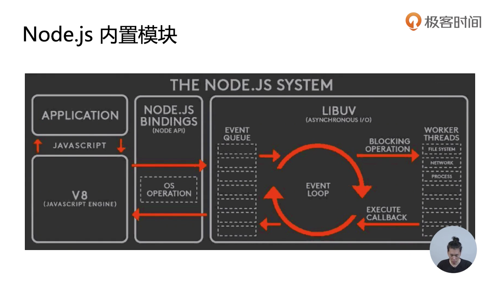
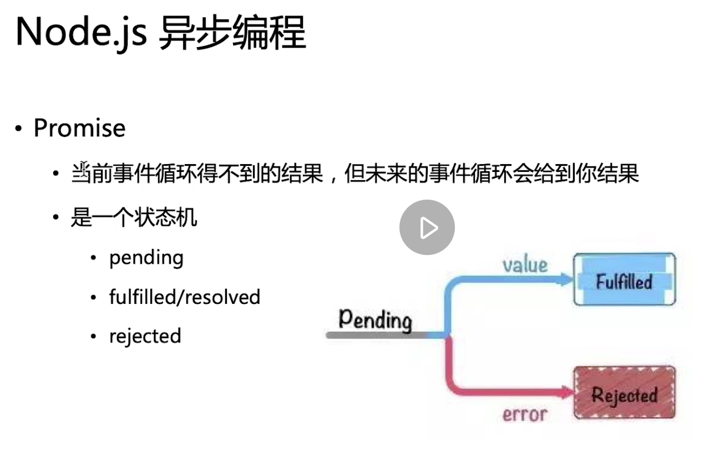

# 1. commonjs的导入规则

## 1.1 exports对象

在commonjs的导入规则中，module.exports是个正常的js的对象。

它可以被添加不同的key值，也是此文件想被导出的东西，比如函数啊，对象啊，变量啊。

同时它的导出的这个对象就是module.exports对象的引用，意味这导出的对象的修改会导致原文件module.exports对象的修改

如果没有module.exports的话，exports也可以被导出。

# 2. nodejs内置模块

## 2.1 应用程序主动去获取的内置模块或方法

大多数nodejs的内置模块是通过v8的nodejs bindings，到libuv获得的。比如os模块的`os.cpus()`方法等。

## 2.2 os系统主动来通知的内置模块或方法

在nodejs中有个Events模块，里面有个EventEmitter类。继承了这个类的子类的实例可以抛出事件，并且带出数据。

然后我们在应用程序层面可以通过导出这个实例，并且使用它的`addListener()`或者简单的`on()`可以监听这些事件，获得数据。

这种叫做观察者模式，它理想的场景具有两个特点

- 不需要知道被通知者的存在

- 没有人听还能继续下去

# 3. 异步

## 3.1 理解非阻塞I/O的关键

- 确定一个进行I/O的系统（确定系统边界）：这个很重要。因为不要视角集中在一个小系统中，放到宏观的角度来讲，无论阻塞不阻塞，都是需要被计算的，计算呢就是需要等待的。

- 思考在I/O过程中，能不能进行其他I/O

上面这个图就是明确了所谓的nodejs的单线程的边界，也是所谓异步I/O的边界。

可以把一些耗时的操作丢给其他的线程执行。然后由于nodejs单线程额设计，也避免了类似c++中多线程编程的变量读写冲突了，nodejs的变量总是线程安全的。

## 3.2 回调函数(callback())

写回调函数的规范，是第一个参数必须是error，接着的参数才是结果。

### 3.2.1 try catch

能捕获到本调用栈里面函数抛出来的错误。但是其他调用栈的函数跑出来的错误是捕捉不到的，如果不能被捕捉到，就会引起nodejs的全局错误，nodejs线程挂掉。

而每一个事件循环都是一个全新的函数调用栈。所以在使用try catch的时候是抓不到异步调用抛出的错误的。这个时候就得用回调函数的error参数来传错误。

### 3.2.2 callback的异步调用流程控制的难题

- 回调地狱

- 异步的并发

  - npm: async.js

  - thunk，一种编程范式。

- （说明），因为callback也被async/await慢慢取代了，所以这些解决方案都慢慢用得很少了。

## 3.3 事件循环

是回调函数成功之后的callback函数执行的队列。这个队列其实不只一个，具体不展开了。

## 3.4 promise

### 3.4.1 基本知识

.then和.catch

- resolved状态的Promise会回调后面的第一个.then

- rejected状态的Promise会回调后面的第一个.catch

- 任何一个rejected状态且后面没有.catch的Promise，都会造成浏览器/node环境的全局错误

### 3.4.2 异步流程控制

promise优秀的地方就在于能解决异步流畅控制问题

执行then和catch会返回一个新的Promise，该Promise最终状态根据then和catch的回调函数的执行结果决定

- 如果回调函数最终是throw，该Promise是rejected状态

- 如果回调函数最终是return，该Promise是resolved状态

- 单如果回调函数最终return了一个Promise，该Promise会和回调函数return的Promise状态保持一致

## 3.5 async/await

async function就是Promise的语法糖封装。意思是async function返回的也是个Promise

异步编程的终极方案-以同步的方式写异步

  - await关键字可以“暂停”async function的执行

  - await关键字可以以同步的写法获取Promise的执行结果

  - try-catch可以获取await所得到的错误

它是一个穿越了事件循环存在的function

